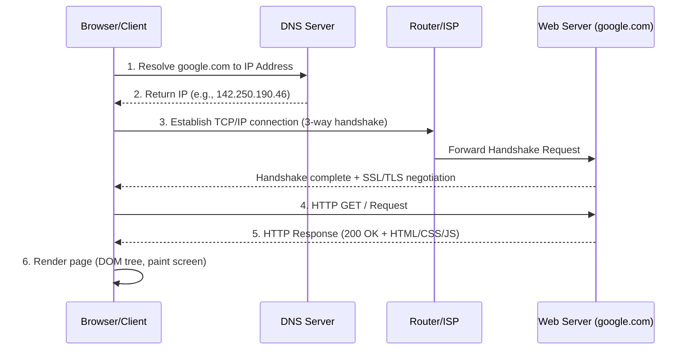

# Ultimate Interview Preparation Guide: Programming, Web Development, Java & Spring Boot

## Table of Contents
1. [Category 1: Core Programming Concepts & Web Architecture](#category-1-core-programming-concepts--web-architecture)
2. [Category 2: Python, FastAPI & Web APIs](#category-2-python-fastapi--web-apis)
3. [Category 3: Core Java Programming](#category-3-core-java-programming)
4. [Category 4: Spring Framework & Maven](#category-4-spring-framework--maven)
5. [Category 5: JDBC, Hibernate (ORM) & Database Concepts](#category-5-jdbc-hibernate-orm--database-concepts)

---

## Category 1: Core Programming Concepts & Web Architecture

### 1. What is a statically typed language vs. a dynamically typed language?
The primary difference lies in **when** variable types are checked and bound.

| Feature | Statically Typed Languages | Dynamically Typed Languages |
| :--- | :--- | :--- |
| **Type Checking Time** | At Compile Time. | At Runtime (during execution). |
| **Declaration Requirement** | Variables must be declared with a data type before use. | Variables do not need type declarations; types are associated with values. |
| **Error Detection** | Errors are caught early during compilation. | Type errors are caught only during execution, which can lead to runtime crashes. |
| **Examples** | Java, C++, C#, Go, Rust. | Python, JavaScript, Ruby, PHP. |

**Example (Java - Static):**
```java
int number = 10; // Valid
number = "Hello"; // Compile-time error: incompatible types
```

**Example (Python - Dynamic):**
```python
number = 10      # Valid
number = "Hello" # Valid, type dynamically changes to String at runtime
```

---

### 2. Which is faster: a compiler or an interpreter?
* **Short Answer:** A **compiler** produces code that executes much faster, but the **interpreting process** has a faster start-up time because it doesn't require a separate compilation phase.
* **Explanation:**
  * **Compiler:** Translates the entire source code into native machine code (binary) at once before execution. The resulting executable runs directly on the hardware at maximum speed (e.g., C++, Rust).
  * **Interpreter:** Translates and executes the source code line-by-line (or instruction-by-instruction) at runtime. This adds overhead because translation happens during execution, making it slower (e.g., standard Python, JavaScript).

---

### 3. What happens behind the scenes when you search `google.com` in a browser?
This is a classic system-design/networking question. Here is the step-by-step lifecycle of the request:



1. **DNS Resolution:** The browser checks cache (browser, OS, router, ISP). If not found, it queries DNS servers recursively to resolve the hostname `google.com` to an IP address (e.g., `142.250.190.46`).
2. **TCP 3-Way Handshake:** The browser initiates a connection with the server using the IP address on Port 80 (HTTP) or 443 (HTTPS). It exchanges `SYN`, `SYN-ACK`, and `ACK` packets to establish the connection.
3. **TLS/SSL Handshake:** For secure HTTPS, the client and server negotiate encryption keys and verify certificates.
4. **HTTP Request:** The browser sends an HTTP request (e.g., `GET / HTTP/1.1`) containing headers, cookies, and user agent info.
5. **Server Processing & Response:** The load balancer routes the request to a web server. The server processes it (often querying databases) and returns an HTTP response containing the status code (e.g., `200 OK`) and the payload (HTML, CSS, JavaScript).
6. **Browser Rendering:** The browser parses the HTML to build the DOM tree, requests static assets (CSS, JS, images), executes JS, and paints the page on the screen.

---

### 4. What are tokens (tokenizer)?
* **Token:** A token is the smallest individual unit of significance in source code or text (e.g., keywords like `if`, identifiers like `variableName`, operators like `+`, and literals like `42`).
* **Tokenizer (Lexical Analyzer):** A program/module that reads an input stream of characters (raw source code or text) and groups them into logical tokens, discarding whitespace and comments.
* **Context (Compilers & LLMs):**
  * **Compilers:** The tokenizer converts `int x = 5;` into tokens: `[KEYWORD("int"), IDENTIFIER("x"), OPERATOR("="), LITERAL("5"), SEMICOLON(";") ]`.
  * **AI/LLMs (NLP):** Tokenizers split text into sub-words or characters (e.g., "antigravity" -> `["anti", "gravity"]`) and convert them into numerical IDs for neural networks to process.

---

### 5. Node.js is a runtime environment to run JavaScript code outside the browser. Explain this statement.
* **Historically:** JavaScript was restricted to running inside web browsers (using engines like Chrome's V8 or Firefox's SpiderMonkey) to make web pages interactive. It lacked access to the OS filesystem, network sockets, or system hardware due to security sandboxes.
* **Enter Node.js:** Ryan Dahl extracted Google Chrome's open-source **V8 JavaScript Engine** and wrapped it with a C++ layer containing APIs for OS-level tasks.
* **Meaning of "Runtime Environment":** Node.js provides the execution context (call stack, heap, event loop) and system APIs (like the `fs` module for files, `http` for servers) that allow JavaScript to run directly on an operating system as a backend language—just like Python or Java.

---

### [Added] 5 Important Category 1 Interview Questions

#### Q1: What is the difference between Compiled, Interpreted, and JIT-Compiled languages?
* **Compiled:** Code is translated to machine code prior to execution (e.g., C, C++, Go). **Pros:** High performance. **Cons:** Platform-dependent, slow development cycle.
* **Interpreted:** Code is read and executed line-by-line at runtime (e.g., Python, Ruby). **Pros:** Fast prototyping, platform-independent. **Cons:** Slower execution.
* **JIT-Compiled (Just-In-Time):** Code is compiled to an intermediate representation (like Java Bytecode or .NET MSIL). At runtime, the Virtual Machine (JVM/CLR) compiles frequently executed code paths ("hotspots") directly into native machine code on-the-fly. **Pros:** Combines platform independence with high runtime speeds (e.g., Java, C#, modern JavaScript).

#### Q2: Explain the difference between Multithreading and Multiprocessing.
* **Multithreading:** Multiple execution threads run within the **same process** sharing memory space (heap, global variables).
  * *Pros:* Low overhead, extremely fast communication between threads.
  * *Cons:* Risk of race conditions, deadlocks, and requires complex synchronization (locks, semaphores).
* **Multiprocessing:** Multiple independent **processes** run concurrently, each having its own dedicated memory space.
  * *Pros:* Fault isolation (one crashed process doesn't crash others), bypasses Python's GIL.
  * *Cons:* Higher memory overhead, slower communication (requires IPC: Inter-Process Communication, sockets, pipes).

#### Q3: What is the difference between REST and gRPC APIs?
* **REST (Representational State Transfer):**
  * Uses HTTP/1.1.
  * Payloads are typically text-based JSON or XML.
  * Loose contract (API documentation is separate, e.g., Swagger).
  * Highly compatible and human-readable.
* **gRPC (Google Remote Procedure Call):**
  * Uses HTTP/2 (supports multiplexing and streaming).
  * Payloads are binary-serialized using **Protocol Buffers (Protobuf)**, which are much smaller and faster to parse.
  * Strict contract defined in a `.proto` file.
  * Ideal for internal microservices communication due to speed and efficiency.

#### Q4: Explain the CAP Theorem.
In any distributed data store, you can only guarantee two out of the following three properties simultaneously:
1. **Consistency (C):** Every read receives the most recent write or an error.
2. **Availability (A):** Every non-failing node returns a non-error response (without guarantee that it contains the most recent write).
3. **Partition Tolerance (P):** The system continues to operate despite arbitrary message loss or network failure between nodes.
* *Interview Insight:* In a real distributed system, network partitions (P) are inevitable. Therefore, systems must choose between Consistency (CP, e.g., HBase, MongoDB) or Availability (AP, e.g., Cassandra, DynamoDB).

#### Q5: How does HTTPS utilize both Symmetric and Asymmetric encryption?
* **Asymmetric Encryption (Public/Private Key):** Used during the **TLS handshake** stage. The client uses the server's public key to safely negotiate and share a temporary "session key". Since it is computationally heavy, it is only used for the initial setup.
* **Symmetric Encryption (Single Shared Key):** Once the session key is securely shared between the client and server, all subsequent data transmission is encrypted/decrypted using this session key because symmetric encryption is significantly faster.

---

## Category 2: Python, FastAPI & Web APIs

### 1. What is a Base URL and API Endpoint?
* **Base URL:** The primary web address of an API service. It points to the root of the API server.
  * *Example:* `https://api.github.com`
* **API Endpoint:** The specific path appended to the Base URL to target a particular resource or perform a specific operation.
  * *Example:* `/users/PratikDevadhe/repos`
  * *Full Request URL:* `https://api.github.com/users/PratikDevadhe/repos`

---

### 2. Comparison between FastAPI, Flask, and Django

| Feature | FastAPI | Flask | Django |
| :--- | :--- | :--- | :--- |
| **Performance** | Extremely High (on par with Go/Node.js) due to Starlette and ASGI. | Moderate (synchronous by default, WSGI-based). | Moderate (heavy weight, WSGI-based by default). |
| **Built-in Validation**| Automatic and robust via **Pydantic**. | Manual (requires external libraries like Marshmallow). | Built-in via Django Forms / Serializers. |
| **Auto API Docs** | Out-of-the-box (Swagger UI at `/docs` and ReDoc at `/redoc`). | No (requires packages like Flask-Smorest). | No (requires third-party packages like DRF-Spectacular). |
| **Async Support** | Native (first-class support for `async`/`await`). | Limited (introduced recently, not native to core architecture). | Added recently (ASGI support, but ORM is still complex to run async). |
| **Learning Curve** | Gentle/Moderate. | Very Easy (minimalist micro-framework). | Steep (full-featured, opinionated, "Django-way"). |
| **Best For** | High-performance REST APIs, Microservices, ML model serving. | Small projects, quick prototypes, simple web apps. | Large-scale enterprise applications, content portals. |

---

### 3. Async and Await in Python
* **Asynchronous Programming:** Allows execution of tasks without blocking the main thread. If a task is waiting for an I/O operation (like a database query or external API call), Python pauses it and runs other tasks.
* **`async def`**: Declares a function as a **coroutine**. Calling this function doesn't run it immediately; instead, it returns a coroutine object.
* **`await`**: Pauses the execution of the coroutine until the awaited task (another coroutine or future) finishes, yielding control back to the event loop.

**Example Code:**
```python
import asyncio
import time

async def fetch_data(delay: int):
    print("Start fetching...")
    await asyncio.sleep(delay)  # Non-blocking sleep
    print("Data retrieved!")
    return {"data": 123}

async def main():
    start = time.time()
    # Runs both tasks concurrently
    results = await asyncio.gather(fetch_data(2), fetch_data(2))
    print(f"Elapsed time: {time.time() - start:.2f} seconds") # Prints ~2.00 seconds, not 4!

asyncio.run(main())
```

---

### 4. FastAPI Architecture
FastAPI stands on the shoulders of two giants:
1. **Starlette:** A lightweight ASGI framework/toolkit. It provides the routing, middleware, event loop, and high-performance web capabilities.
2. **Pydantic:** A data validation and settings management library using Python type annotations. It handles serialization, deserialization (parsing), and data validation.

```
       +---------------------------------------------+
       |                  FastAPI                    |
       +----------------------+----------------------+
                              |
            +-----------------+-----------------+
            |                                   |
    +-------v-------+                   +-------v-------+
    |   Starlette   |                   |   Pydantic    |
    | (Web & Routing|                   | (Data Parsing |
    |  ASGI Core)   |                   | & Validation) |
    +-------+-------+                   +---------------+
            |
    +-------v-------+
    |    Uvicorn    | (ASGI Web Server)
    +---------------+
```

---

### 5. ASGI vs. WSGI
* **WSGI (Web Server Gateway Interface):**
  * The older Python standard for web applications (PEP 3333).
  * Synchronous, single-connection-at-a-time design.
  * Runs one request to completion on a thread before picking up the next.
  * *Examples:* Gunicorn, uWSGI (used by Django, Flask).
* **ASGI (Asynchronous Server Gateway Interface):**
  * The modern successor to WSGI (backward-compatible with WSGI).
  * Supports asynchronous execution patterns natively.
  * Handles concurrent connections (WebSockets, Long Polling, Server-Sent Events).
  * *Examples:* Uvicorn, Daphne (used by FastAPI, modern Django).

---

### 6. Dependency Resolution, Packages, and Commands

#### What is Dependency Resolution?
The process by which a package manager (like `pip` or `npm`) resolves conflict versions to ensure all packages and their transitively required packages can run together without version mismatches.

#### Where do Python packages go after installation?
They are installed inside a directory named `site-packages` within your Python environment.
* **Global path (Linux):** `/usr/local/lib/python3.x/dist-packages`
* **Virtual Environment path:** `your_env/lib/python3.x/site-packages`

#### Commands:
* **List installed packages:**
  ```bash
  pip list
  # Or to show dependencies in a requirements format
  pip freeze
  ```

---

### 7. PUT vs. PATCH HTTP Methods
* **`PUT` (Idempotent):** Replaces the **entire** resource with the payload. If fields are omitted in the payload, they may be overwritten with null or defaults. If the resource doesn't exist, `PUT` can create it (if configured).
* **`PATCH` (Idempotent):** Performs a **partial update** to a resource. It only modifies the fields supplied in the payload, leaving other existing fields untouched.

---

### 8. Decode: `http://127.0.0.1:8000`
* **`http://`**: The communication protocol (Hypertext Transfer Protocol).
* **`127.0.0.1`**: The **Loopback IP address** (also known as `localhost`). It points back to your local computer.
* **`:8000`**: The **Port number** on which the local web server is listening.

---

### 9. What is a Path Parameter?
A **Path Parameter** is a variable embedded directly within the URL path, used to identify a specific resource.

* *Example URL:* `/users/42`
* *Path Param:* `user_id = 42`
* *FastAPI Code:*
  ```python
  @app.get("/users/{user_id}")
  def get_user(user_id: int):
      return {"user_id": user_id}
  ```

> [!NOTE]
> **vs. Query Parameter:** Appended at the end of the URL after a `?` (e.g. `/users?limit=10`). Used to filter, sort, or paginate results.

---

### 10. FastAPI Auto-Generated Documentation
FastAPI automatically generates interactive API documentation based on OpenAPI standards.
* **Interactive UI (Swagger):** Accessible at `http://localhost:8000/docs`. Allows developers to test API endpoints directly from the browser.
* **Alternative UI (ReDoc):** Accessible at `http://localhost:8000/redoc`. Provides a clean, read-only 3-column layout.

---

### 11. How to handle URL-encoded data from forms in FastAPI?
You must install `python-multipart` first: `pip install python-multipart`. Then import and use the `Form` parameter class.

```python
from fastapi import FastAPI, Form

app = FastAPI()

@app.post("/login/")
async def login(username: str = Form(...), password: str = Form(...)):
    return {"username": username, "status": "Logged In"}
```

---

### 12. How to return custom status codes with messages in FastAPI?
You can declare it in the decorator or raise an `HTTPException`.

**Approach A: Via Decorator (For Success States)**
```python
from fastapi import FastAPI, status

app = FastAPI()

@app.post("/items/", status_code=status.HTTP_201_CREATED)
async def create_item(name: str):
    return {"message": "Item created successfully", "name": name}
```

**Approach B: Via HTTPException (For Error States)**
```python
from fastapi import FastAPI, HTTPException, status

@app.get("/items/{item_id}")
async def get_item(item_id: int):
    if item_id != 1:
        raise HTTPException(
            status_code=status.HTTP_404_NOT_FOUND, 
            detail="Item not found on this server"
        )
    return {"item_id": item_id, "name": "Laptop"}
```

---

### 13. Streamlit UI for Student Manager
Here is a clean, fully functional Streamlit frontend script to manage students.

```python
# app.py
import streamlit as st

# Setup page style
st.set_page_config(page_title="Student Manager", layout="centered")
st.title("🎓 Student Manager App")

# Initialize session state for student database mock
if "students" not in st.session_state:
    st.session_state.students = [
        {"id": 101, "name": "Pratik Devadhe", "course": "Computer Science"},
        {"id": 102, "name": "Jane Doe", "course": "Data Science"}
    ]

# Sidebar for adding a student
st.sidebar.header("Add New Student")
new_id = st.sidebar.number_input("Student ID", min_value=1, step=1, value=103)
new_name = st.sidebar.text_input("Name")
new_course = st.sidebar.text_input("Course")

if st.sidebar.button("Add Student"):
    if new_name and new_course:
        st.session_state.students.append({"id": new_id, "name": new_name, "course": new_course})
        st.sidebar.success(f"Added {new_name}!")
    else:
        st.sidebar.error("Please fill all fields.")

# Main screen operations
st.header("Student List")
if st.session_state.students:
    for idx, student in enumerate(st.session_state.students):
        col1, col2, col3 = st.columns([2, 3, 2])
        col1.write(f"**ID:** {student['id']}")
        col2.write(f"**Name:** {student['name']} ({student['course']})")
        
        # Unique key for delete button
        if col3.button("Delete", key=f"del_{student['id']}_{idx}"):
            st.session_state.students.pop(idx)
            st.rerun()
else:
    st.info("No students registered yet.")
```

---

### [Added] 5 Important Category 2 Interview Questions

#### Q1: What is Dependency Injection in FastAPI, and how does the `Depends` function work?
* **Answer:** Dependency Injection (DI) allows class dependencies to be supplied rather than hardcoded. In FastAPI, `Depends` declares dependencies that need to be evaluated before running the path operation.
* *Example:* Reusing a database session or verifying an OAuth2 token across multiple routes. FastAPI automatically calls the dependent function, handles cleanup (if using `yield`), and injects the result into your route.

#### Q2: What are Python generators (`yield`), and what are their benefits?
* **Answer:** A generator is a function that returns an iterator object using the `yield` keyword instead of `return`. Instead of constructing a list in memory all at once, it yields values one-by-one as requested.
* *Benefit:* Memory efficiency. Generating a stream of 1 million rows using `yield` takes negligible memory compared to returning a list of 1 million objects.

#### Q3: How does the Global Interpreter Lock (GIL) impact Python performance, and how does FastAPI bypass it?
* **Answer:** The GIL is a mutex that protects Python objects, preventing multiple native threads from executing Python bytecodes at once. This makes Python CPU-bound execution single-threaded.
* **FastAPI Bypass:** FastAPI uses an asynchronous event loop (`asyncio`). When an async endpoint performs an I/O-bound operation (e.g. database query, filesystem read, external API fetch) using `await`, it releases control back to the event loop, allowing Python to process other network requests concurrently on a single thread.

#### Q4: How does Pydantic perform validation under the hood in FastAPI?
* **Answer:** Pydantic parses input data and casts it into Python types defined by model annotations (e.g. parsing a string `"123"` to an `int` `123`). If parsing fails, it raises a structured validation error which FastAPI automatically translates into a `422 Unprocessable Entity` HTTP response with details of exactly which fields failed validation.

#### Q5: How do you handle CORS (Cross-Origin Resource Sharing) in FastAPI?
* **Answer:** You must use FastAPI's built-in `CORSMiddleware`.
```python
from fastapi.middleware.cors import CORSMiddleware

app.add_middleware(
    CORSMiddleware,
    allow_origins=["http://localhost:3000"], # Allow specific frontends
    allow_credentials=True,
    allow_methods=["*"],
    allow_headers=["*"],
)
```

---

## Category 3: Core Java Programming

### 1. Difference between Heap Memory and Stack Memory

| Feature | Stack Memory | Heap Memory |
| :--- | :--- | :--- |
| **Storage** | Stores local variables, reference variables, and method execution frames. | Stores all actual objects (instantiated via `new`). |
| **Lifecycle** | Linked to thread execution (LIFO - Last In First Out). Reclaimed automatically when a method finishes. | Reclaimed by the Garbage Collector when objects are no longer referenced. |
| **Size** | Small and fixed. | Much larger, dynamic. |
| **Access Speed**| Very fast. | Slower (requires dereferencing objects). |

---

### 2. What is Autoboxing and Auto-unboxing?
* **Autoboxing:** The automatic conversion that the Java compiler makes between primitive types and their corresponding object wrapper classes.
  * *Example:* Converting `int` to `Integer` -> `Integer x = 10;`
* **Auto-unboxing:** The reverse process; converting an object wrapper class back to its primitive type.
  * *Example:* Converting `Integer` to `int` -> `int y = x;`

---

### 3. What is Swing in Java?
* **Swing:** A GUI (Graphical User Interface) widget toolkit that is part of Java Foundation Classes (JFC).
* **Key Features:**
  * Written entirely in Java (platform-independent).
  * "Lightweight" components (they don't rely on native OS peer resources, unlike older AWT).
  * Highly customizable look-and-feel.
  * Mostly legacy today; replaced by JavaFX or modern web technologies.

---

### 4. Internal Working of `HashMap` in Java
A `HashMap` stores key-value pairs using a technique called **Hashing**.

```
    HashMap (Array of Buckets / Node[])
    +---+---+---+---+---+
    | 0 | 1 | 2 | 3 | 4 |
    +---+---+---+---+---+
          |       |
          |       +--> Node(K3, V3) -> Null
          v
      Node(K1, V1) -> Node(K2, V2) [Linked List (pre-Java 8)]
```

* **Data Structure:** Array of buckets (Nodes). Each Node contains: `int hash`, `K key`, `V value`, and `Node<K,V> next`.
* **Put Operation:**
  1. Calls `hashCode()` on the key to calculate an integer hash value.
  2. Applies a hash function to map this hash to an index in the bucket array: `index = hash & (n - 1)`.
  3. If the bucket is empty, a new Node is created.
  4. If a collision occurs (same index):
     - **Pre-Java 8:** Placed in a linked list at that index.
     - **Java 8+:** If the linked list size exceeds threshold `TREEIFY_THRESHOLD = 8` and total array capacity is at least 64, the linked list converts to a **Balanced Red-Black Tree** (`TreeNode`) to improve lookup from $O(N)$ to $O(\log N)$.
* **Get Operation:** Computes hash index, traverses the linked list or tree, checking equality using `equals()` on keys.

---

### 5. Comparable vs. Comparator

| Feature | Comparable | Comparator |
| :--- | :--- | :--- |
| **Method** | `public int compareTo(T o)` | `public int compare(T o1, T o2)` |
| **Package** | `java.lang` | `java.util` |
| **Modifications**| Modifies the actual class to implement sorting (implements `Comparable`). | Written as a separate class or lambda expression; does not modify the target class. |
| **Sort Variety** | Single/Default sorting sequence. | Multiple sorting sequences (e.g. by Name, by Age). |

---

### 6. Ways to create a Thread in Java
There are three primary ways to create a thread:
1. **Extend the `Thread` class:**
   ```java
   class MyThread extends Thread {
       public void run() { System.out.println("Running"); }
   }
   new MyThread().start();
   ```
2. **Implement the `Runnable` interface (Preferred over extending Thread):**
   ```java
   class MyRun implements Runnable {
       public void run() { System.out.println("Running"); }
   }
   new Thread(new MyRun()).start();
   ```
3. **Using Callable & Future (Allows returning values):**
   ```java
   ExecutorService executor = Executors.newSingleThreadExecutor();
   Future<String> future = executor.submit(() -> "Task completed");
   String result = future.get(); // Blocks until result is ready
   ```

---

### 7. How to return something from a Thread's `run()` method?
The `Runnable.run()` method has a `void` return signature. To return a result, you must use **`java.util.concurrent.Callable`**:
* **Callable:** Contains a `call()` method that throws checked exceptions and returns a value.
* **Future:** Used to capture the result asynchronously from `ExecutorService.submit(Callable)`.

```java
import java.util.concurrent.*;

public class CallableExample {
    public static void main(String[] args) throws Exception {
        ExecutorService executor = Executors.newFixedThreadPool(1);
        Callable<Integer> task = () -> {
            Thread.sleep(1000);
            return 42;
        };
        Future<Integer> future = executor.submit(task);
        System.out.println("Result: " + future.get()); // Blocks and outputs 42
        executor.shutdown();
    }
}
```

---

### 8. Issues with the `synchronized` keyword
The `synchronized` keyword prevents race conditions but introduces several issues:
1. **Performance Bottleneck:** Only one thread can enter the synchronized block. Other threads are blocked, causing context switching overhead.
2. **Risk of Deadlocks:** If Thread A holds Lock 1 and waits for Lock 2, while Thread B holds Lock 2 and waits for Lock 1, the program freezes forever.
3. **No Timeout:** A thread waiting for a synchronized monitor cannot time out; it will wait indefinitely.
4. **Thread Starvation:** High priority threads might hog locks, starving low priority threads.
* *Modern Solution:* Use `java.util.concurrent.locks.ReentrantLock` or Atomic variables (`AtomicInteger`).

---

### 9. Java 8 vs. Java 14 Features
* **Java 8 Key Features (2014):**
  * **Lambda Expressions:** `() -> System.out.println("Hello")`
  * **Stream API:** Functional-style operations on collections.
  * **Functional Interfaces:** `@FunctionalInterface` (e.g., Predicate, Function).
  * **Optional Class:** Container object to avoid `NullPointerException`.
  * **Default/Static Methods in Interfaces:** Interfaces can have implementations.
* **Java 14 Key Features (2020):**
  * **Switch Expressions (Standardized):** Can yield values directly (`yield` keyword).
  * **Pattern Matching for `instanceof` (Preview):** `if (obj instanceof String s)` (no manual casting needed).
  * **Records (Preview):** Lightweight data classes.
  * **Helpful NullPointerExceptions:** Explains exactly which method or field was null.

---

### 10. Stream API Operations
Streams process sequences of data elements in a pipeline.

```
                  +--------------------------------+
                  |           DataSource           |
                  +---------------+----------------+
                                  |
                   +--------------+---------------+
                   |     Intermediate Operations  | (Lazy)
                   |  (filter, map, sorted, etc.) |
                   +--------------+----------------+
                                  |
                   +--------------v---------------+
                   |      Terminal Operations     | (Triggers execution)
                   | (collect, count, reduce,etc.)|
                   +------------------------------+
```

1. **Intermediate Operations (Lazy - return another Stream):**
   * `filter(Predicate)`: Retains elements matching a condition.
   * `map(Function)`: Transforms elements.
   * `sorted()`: Sorts elements.
2. **Terminal Operations (Trigger processing - close Stream, return non-stream value):**
   * `collect(Collector)`: Gathers elements into a Collection.
   * `forEach(Consumer)`: Iterates over each element.
   * `reduce()`: Combines elements into a single value.

**Example Code:**
```java
List<String> names = Arrays.asList("Alex", "Bob", "Alice");
List<String> filtered = names.stream()
                             .filter(name -> name.startsWith("A")) // Intermediate
                             .map(String::toUpperCase)             // Intermediate
                             .collect(Collectors.toList());        // Terminal
```

---

### 11. What is a Functional Interface?
An interface that has **exactly one abstract method** (SAM). It can have multiple `default` or `static` methods.
* **Annotation:** `@FunctionalInterface` (compiler checks constraint).
* *Purpose:* Enables Lambda expressions to be used as types.
* *Examples:* `Runnable` (has `run()`), `Comparator` (has `compare()`).

---

### [Added] 5 Important Category 3 Interview Questions

#### Q1: What is the volatile keyword in Java?
* **Answer:** The `volatile` keyword guarantees **visibility** of variables across threads. When a variable is marked `volatile`, it is read from and written to the CPU's main memory directly, rather than local CPU caches. It ensures that changes made by one thread are immediately visible to all other threads. However, it does **not** guarantee atomicity (e.g., `count++` is still not thread-safe).

#### Q2: What is the Java Garbage Collection (GC) process?
* **Answer:** GC runs on a daemon thread to reclaim memory occupied by unreachable objects. Java divides the Heap into **Young Generation** (where new objects are allocated) and **Old Generation** (where long-lived objects reside). 
  1. Minor GC runs on the Young Gen using "Mark-Copy".
  2. Major GC runs on the Old Gen using "Mark-Sweep-Compact".

#### Q3: Difference between Fail-Fast and Fail-Safe Iterators.
* **Fail-Fast (e.g., `ArrayList` Iterator):** Throws `ConcurrentModificationException` immediately if the collection is structurally modified (added/removed) after the iterator is created. It tracks a `modCount` variable.
* **Fail-Safe (e.g., `CopyOnWriteArrayList` Iterator):** Operates on a clone/copy of the collection. It does not throw exceptions if the collection is modified, but it won't reflect changes made during iteration.

#### Q4: What are Java Records (introduced as preview in 14, standard in 16)?
* **Answer:** Records are a special class type designed to act as immutable data carriers. The compiler automatically generates the constructor, fields, getter methods (using the field names directly without "get"), `equals()`, `hashCode()`, and `toString()`.
```java
public record User(String username, int id) {}
```

#### Q5: How does `CompletableFuture` differ from `Future`?
* **Answer:** `Future` does not allow manual completion, cannot be chained with callbacks, and lacks exception handling capabilities. `CompletableFuture` implements `Future` and `CompletionStage`, enabling asynchronous pipelines (using `thenApply`, `thenAccept`), manual completion, and robust error fallback functions (using `exceptionally`).

---

## Category 4: Spring Framework & Maven

### 1. What is Spring?
Spring is an open-source, lightweight application framework for Java enterprise development. Its primary goal is to make Java EE development easier by promoting good design practices based on interface-based programming, loose coupling, and dependency injection.

---

### 2. What is Maven?
Maven is a **build automation and project management tool** used primarily for Java projects.
* **POM (`pom.xml`):** Project Object Model file that lists project metadata, dependencies, build configurations, and plugins.
* **Maven catalog internal / `maven-archetype-quickstart` 1.1:**
  * **Archetype:** A template for generating new Maven projects.
  * **`maven-archetype-quickstart`:** A basic Maven template containing a skeleton main class (`App.java`) and a test class (`AppTest.java`).
  * **Catalog internal:** References local/default archetypes bundled inside Maven rather than querying remote repositories.

---

### 3. Inversion of Control (IoC) and Dependency Injection (DI)
* **Inversion of Control (IoC):** A design principle where the control of object creation, configuration, and lifecycle is shifted from the application code to a container or framework (e.g., Spring IoC Container).
* **Dependency Injection (DI):** The pattern/implementation of IoC. Instead of an object constructing its own dependencies (using `new`), the container injects (injects) those dependencies from the outside.

```
       WITHOUT DI (Tightly Coupled):
       [MyService] -- instantiated via new --> [MyRepository]

       WITH DI (Spring IoC):
       [MyRepository] --- registers in ---> [ Spring Container ]
                                                    |
                                             injects dependency
                                                    |
                                                    v
                                               [MyService]
```

---

### 4. What is Aspect-Oriented Programming (AOP)?
* **AOP:** A programming paradigm that modularizes **cross-cutting concerns**—features that span multiple modules of an application (e.g., logging, security, transactions).
* **Core Concepts:**
  * **Aspect:** The modularized class containing cross-cutting logic.
  * **Join Point:** A point during execution (usually a method execution) where an Aspect can be applied.
  * **Advice:** The action taken at a Join Point (Before, After, Around).
  * **Pointcut:** An expression that selects specific Join Points (matches methods).

---

### 5. What is Autowiring? What are its types?
**Autowiring:** A feature of Spring where the container automatically resolves and injects collaborating beans into a bean's fields, constructors, or setters.

**Types of Autowiring:**
1. **`no`:** Default. Autowiring is disabled; dependencies must be manually declared.
2. **`byName`:** Injects a bean whose name matches the property name of the dependency.
3. **`byType`:** Injects a bean whose class type matches the property type of the dependency. If multiple beans of the same type exist, it throws an exception.
4. **`constructor`:** Similar to `byType` but applies to constructor arguments.

---

### 6. Tightly Coupled vs. Loosely Coupled

| Aspect | Tightly Coupled | Loosely Coupled |
| :--- | :--- | :--- |
| **Object Creation** | Instantiated directly with `new` (e.g., `A a = new A()`). | Injected via interface contracts (e.g., `private Engine engine`). |
| **Flexibility** | Hard to change implementations; requires recompilation of multiple files. | Easy to swap components (e.g., swapping MySQL database implementation for PostgreSQL). |
| **Testing** | Difficult to unit test; cannot mock dependencies easily. | Easy to unit test using mock objects (e.g., Mockito). |

---

### 7. IoC Container types: BeanFactory vs. ApplicationContext
* **`BeanFactory`:** The basic IoC container. It uses **lazy initialization** (instantiates beans only when `getBean()` is called). Highly lightweight; used in memory-constrained devices.
* **`ApplicationContext`:** Extends `BeanFactory`. It uses **eager initialization** (instantiates all singleton beans during startup). It adds enterprise features: AOP integration, internationalization (i18n), and event publishing.

---

### 8. Transactions & Propagation Levels
A **Transaction** in Spring ensures ACID properties across multiple database operations. Defined using `@Transactional`.

**Transaction Propagation Levels** define the transactional boundary behavior when a transactional method calls another method:
1. **`REQUIRED` (Default):** Joins the existing transaction if present; creates a new transaction if none exists.
2. **`REQUIRES_NEW`:** Always suspends the current transaction and creates a new, independent transaction.
3. **`SUPPORTS`:** Executes within a transaction if one exists; runs without a transaction if none exists.
4. **`NOT_SUPPORTED`:** Always runs without a transaction; suspends the current transaction if present.
5. **`MANDATORY`:** Requires an active transaction; throws an exception if none exists.
6. **`NEVER`:** Throws an exception if an active transaction exists.
7. **`NESTED`:** Runs inside a nested transaction (using database savepoints). If the nested transaction fails, it rolls back to the savepoint without rolling back the outer transaction.

---

### 9. Bean Creation using Java Configuration File
You can define Spring configurations using Java classes marked with `@Configuration` instead of XML files.

```java
import org.springframework.context.annotation.*;

@Configuration
public class AppConfig {
    
    @Bean
    public UserRepository userRepository() {
        return new UserRepositoryImpl(); // Creates a bean named "userRepository"
    }
    
    @Bean
    public UserService userService() {
        // Dependency Injection via method call
        return new UserServiceImpl(userRepository()); 
    }
}
```

---

### 10. Autowire Resolution for Two Beans of the same Class
**Scenario:** Two beans of type `Engine` exist in the container. `Car` has a property of type `Engine` and uses `autowire='byType'`.

#### What happens?
Spring will throw a **`NoUniqueBeanDefinitionException`** (or `UnsatisfiedDependencyException`) during context initialization because it cannot determine which of the two beans to inject.

#### How to resolve this issue:
1. **Use `@Primary`:** Mark one of the two beans with `@Primary`. Spring will favor this bean whenever there is ambiguity.
   ```java
   @Bean
   @Primary
   public Engine sportsEngine() { return new SportsEngine(); }
   ```
2. **Use `@Qualifier`:** Specify the exact bean ID you want to inject at the insertion point.
   ```java
   @Autowired
   @Qualifier("sportsEngine")
   private Engine engine;
   ```
3. **By Name matching:** If using Autowired, Spring defaults to naming matching as a fallback. Rename your variable to match the exact bean name (e.g. `private Engine sportsEngine`).

---

### [Added] 5 Important Category 4 Interview Questions

#### Q1: What is the Spring Bean Lifecycle?
* **Answer:** The lifecycle consists of:
  1. **Instantiation:** Spring instantiates the bean class.
  2. **Populate Properties:** Injecting dependencies (@Autowired).
  3. **Aware Interfaces:** Invoking interfaces like `BeanNameAware`, `BeanFactoryAware`.
  4. **Post Initialization:** Running `BeanPostProcessor.postProcessBeforeInitialization()`.
  5. **Initialization Method:** Executing `@PostConstruct` or `InitializingBean.afterPropertiesSet()`.
  6. **Post Initialization Call:** Running `BeanPostProcessor.postProcessAfterInitialization()`.
  7. **Ready to Use:** Bean is ready.
  8. **Destruction:** On container shutdown, `@PreDestroy` or `DisposableBean.destroy()` is called.

#### Q2: What are the Bean Scopes in Spring?
* **Answer:**
  * **Singleton (Default):** Creates only one instance of the bean per Spring IoC Container.
  * **Prototype:** Creates a new instance every time the bean is requested.
  * **Request (Web-only):** Creates one instance per HTTP Request.
  * **Session (Web-only):** Creates one instance per HTTP Session.
  * **Application (Web-only):** One instance per ServletContext.

#### Q3: Difference between `@Component`, `@Service`, `@Repository`, and `@Controller`.
* **Answer:**
  * `@Component`: A generic annotation that registers a class as a Spring Bean.
  * `@Service`: Inherits `@Component`. Used for business layer classes (adds semantic clarity).
  * `@Repository`: Inherits `@Component`. Used for data access layer. Also translates database-specific checked exceptions into Spring's unchecked `DataAccessException`.
  * `@Controller`: Inherits `@Component`. Used for MVC controllers to handle web routing.

#### Q4: How does Spring Boot's Auto-Configuration work under the hood?
* **Answer:** It uses `@EnableAutoConfiguration` (nested inside `@SpringBootApplication`). It scans the classpath for jar dependencies (like `h2.jar`). Using conditional annotations (such as `@ConditionalOnClass` or `@ConditionalOnMissingBean`), it automatically configures corresponding default beans (like the DataSource connection pool) without developer intervention.

#### Q5: What is the difference between `@ControllerAdvice` and `@ExceptionHandler`?
* **Answer:**
  * `@ExceptionHandler` is declared inside a specific controller class to handle exceptions thrown from that controller's request methods.
  * `@ControllerAdvice` is a global interceptor class. Any `@ExceptionHandler` methods declared inside it apply globally across **all** controllers in the application, making exception handling centralized.

---

## Category 5: JDBC, Hibernate (ORM) & Database Concepts

### 1. Primary Key vs. Unique Key

| Feature | Primary Key | Unique Key |
| :--- | :--- | :--- |
| **Null Values** | Cannot contain any `NULL` values. | Can contain one (or more depending on database) `NULL` values. |
| **Limit per Table** | Only one Primary Key allowed per table. | Multiple Unique Keys can be defined on a table. |
| **Index Type** | Automatically creates a Clustered Index. | Automatically creates a Non-Clustered Index. |

---

### 2. JDBC Statement vs. PreparedStatement
* **`Statement`:**
  * Compiles the SQL query every time it is executed.
  * Slower for repeated executions.
  * Vulnerable to **SQL Injection** attacks because inputs are concatenated directly into the query string.
* **`PreparedStatement`:**
  * Pre-compiles the query and stores it in the database server.
  * Faster for repeated executions because the compilation step is done once.
  * Secure against SQL Injection because inputs are parameterized (`?` placeholders).

**Statement (Vulnerable):**
```java
String query = "SELECT * FROM users WHERE name = '" + userName + "'";
statement.executeQuery(query);
```

**PreparedStatement (Secure):**
```java
String query = "SELECT * FROM users WHERE name = ?";
PreparedStatement pstmt = conn.prepareStatement(query);
pstmt.setString(1, userName);
pstmt.executeQuery();
```

---

### 3. What is ORM (Object-Relational Mapping)?
* **ORM:** A software programming technique that links the object-oriented programming language classes to the relational database tables.
* **How it works:** It maps Java Classes to SQL Tables, Class Instance variables to SQL Table Columns, and Object instances to SQL Table Rows.

---

### 4. Problems without ORM
Developing database applications using plain JDBC without an ORM introduces several issues:
1. **Boilerplate Code:** Large amounts of repetitive code to manage connections, statements, mapping `ResultSet` to POJOs, and handling SQL exceptions.
2. **SQL Dependency:** Hardcoded SQL strings tie the application to a specific database dialect (e.g., MySQL syntax vs Oracle syntax), making database migration difficult.
3. **Complex Object Relationship Mapping:** Mapping object relationships (One-to-Many, Many-to-Many) manually using SQL joins and nested loops is highly complex and error-prone.
4. **No Cache Management:** Developers have to write manual caching logic to prevent hitting the database for identical queries.

---

### 5. Hibernate is the ORM Tool
* **Hibernate:** An open-source, lightweight Java ORM framework that implements the JPA (Jakarta Persistence API) specification.
* **Role:**
  * Translates object operations (e.g., `session.save(user)`) into appropriate SQL statements automatically.
  * Provides database independence using database **Dialects**.
  * Offers performance features such as lazy loading, dirty checking, and caching.

---

### [Added] 5 Important Category 5 Interview Questions

#### Q1: What is the N+1 SELECT problem in Hibernate, and how can it be resolved?
* **Answer:** It occurs when you fetch an entity with a one-to-many relationship (lazy loaded). Hibernate first fires 1 query to get the parent entities ($N$ parent records), and then fires $N$ individual queries to fetch the children for each parent.
* **Resolution:**
  1. Use **JOIN FETCH** inside your JPQL/HQL query (e.g. `SELECT p FROM Parent p JOIN FETCH p.children`).
  2. Use `@EntityGraph` annotation to define eager fetch paths.

#### Q2: Explain First-Level Cache vs. Second-Level Cache in Hibernate.
* **First-Level Cache (Session Scope):** Enabled by default and bound to the `Session` object. If you request the same object multiple times in the same session, it is fetched from memory. It is destroyed when the session closes.
* **Second-Level Cache (SessionFactory Scope):** Disabled by default. It is shared across all sessions of the application (usually using provider plugins like Ehcache). It survives session closure.

#### Q3: What are the states of a Hibernate Entity Lifecycle?
* **Transient:** Object is newly created in Java memory (`new User()`) and is not associated with any Hibernate session or database row.
* **Persistent:** Object is associated with an active Hibernate session and has a database representation. Changes to persistent objects are automatically synchronized with the database during flush/commit.
* **Detached:** Session is closed, but the object still has a database representation. It is no longer monitored by Hibernate.
* **Removed:** Object is marked for deletion via `session.delete()`, and will be deleted from the database on session flush.

#### Q4: Lazy Loading vs. Eager Loading in Hibernate.
* **Lazy Loading (`FetchType.LAZY`):** Child collections or related objects are loaded from the database only when they are accessed for the first time (via getter calls). Saves database and memory resources.
* **Eager Loading (`FetchType.EAGER`):** Related objects are fetched immediately along with the parent object using a JOIN query. Good when you are certain you will always need the child collections.

#### Q5: Pessimistic Locking vs. Optimistic Locking.
* **Optimistic Locking:** Assumes conflict is rare. Uses a `@Version` field (integer or timestamp) on the entity. When committing, Hibernate checks if the version in the database matches. If not, another transaction updated it, throwing `OptimisticLockException`.
* **Pessimistic Locking:** Assumes conflicts are frequent. It locks the database record immediately using SQL features like `SELECT ... FOR UPDATE`, blocking other transactions until the lock is released. Good for transaction-sensitive data like banking balances.
